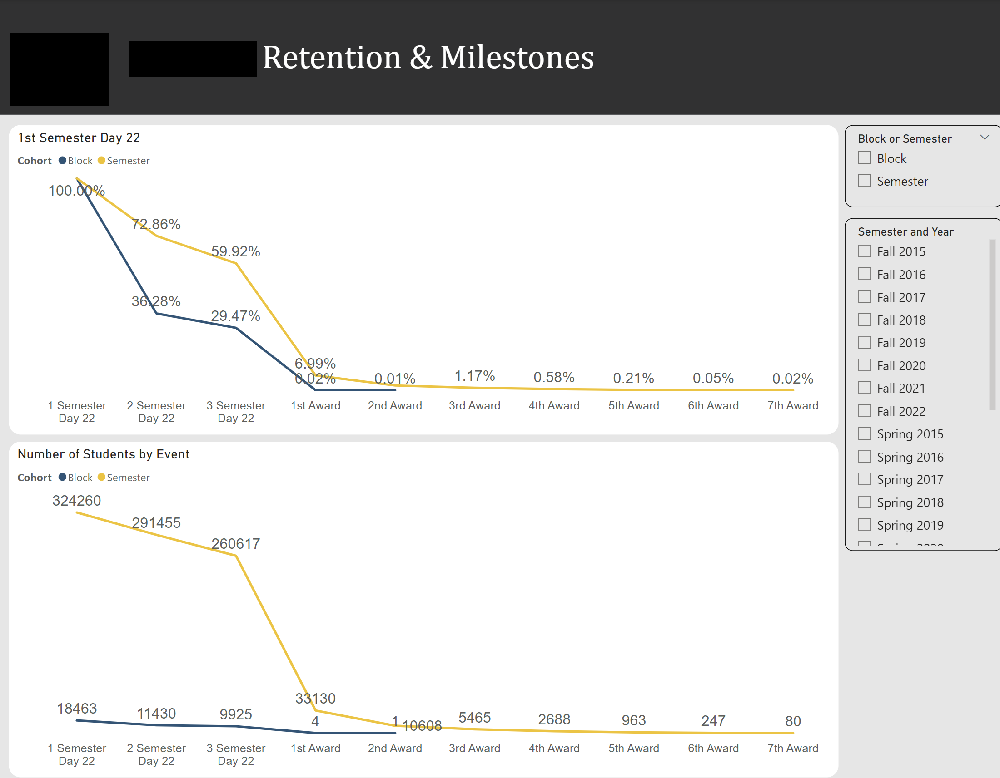
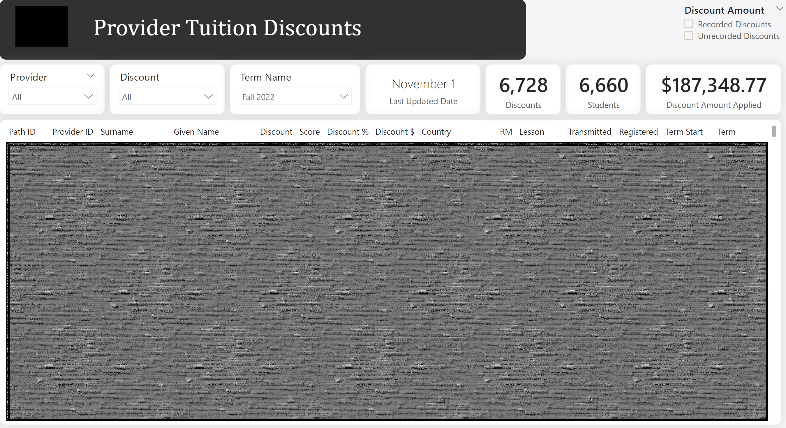
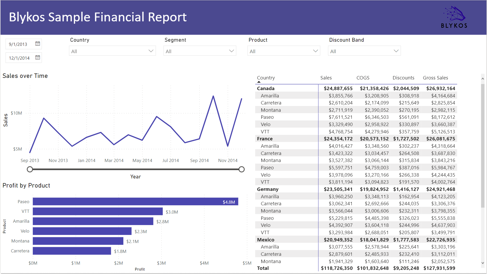
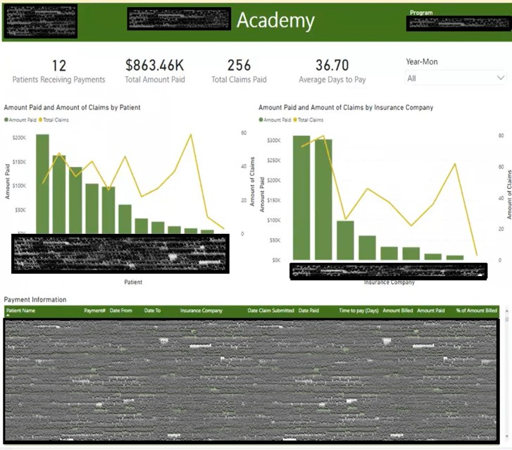
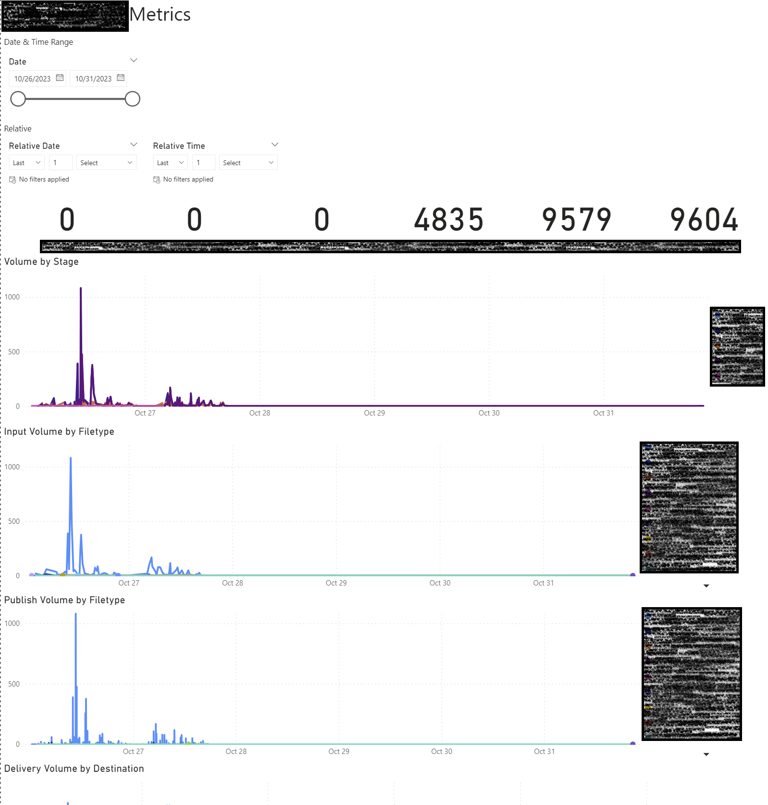
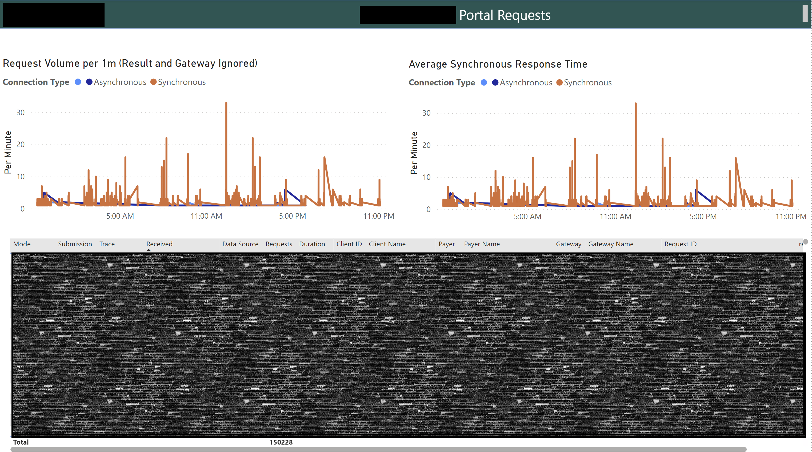
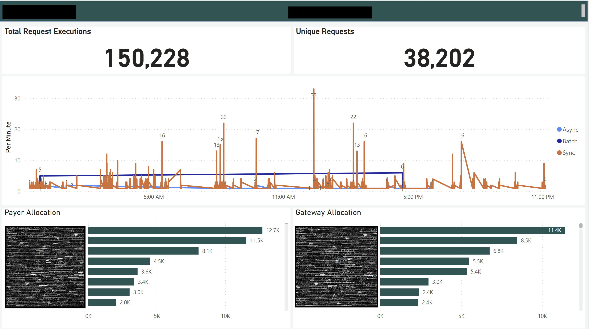
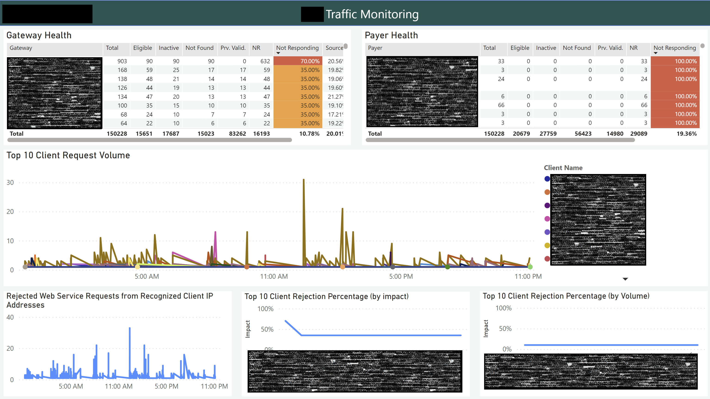

# Dallin Perez Portfolio

## Program Retention
I worked with one of the top Universities in the Midwest to help them analyze one of their learning programs meant to help prepare late learners and students world wide for university. The University was looking to utilize their data on their students including enrollment data to analyze not just how students were progressing, but also track scholarship and any tuition discounts. Below are some of the dashboards created, which connected to an On Premises SQL Server database. Since their data was scattered across their server, we wrote queries to join and union data into tables optimized for Power BI ingestion. After publishing the reports to the online Power BI Service, I assisted in setting up their On Prem Data Gateway so that the scheduled refreshes could successfully execute against the on prem server.

## Financial Dashboard
My brother was interested in starting his own cybersecurity consulting company, and asked for a sample of a Power BI Dashboard so that he could see if it would bring value to what he was doing. I used a sample database to create the following financial report to demonstrate to him the different ways he could track and analyze his financial data in Power BI.

## Insurance Billing
An insurance tracking company needed to analyze their patient and billing data together in one dashboard, so they could better understand and visualize how billing was occurring. I built this dashboard to provide an executive overview of the data at the leve they specified, so that key leadership members could keep on eye on patients, claims, and payments. This data was stored in an Azure SQL Database that already had views containing the appropriate data, however after pushing it into the online Power BI Service I helped configure a Vnet Gateway so that we could set up scheduled refreshes of the data and have it successfully execute from the online service.

## File Transfer Monitoring
This client was performing a migration from Splunk to Azure/Power BI, and needed their file transfer monitoring dashboards converted from Splunk to Power BI. I led a small team on this effort, gathering the information and queries needed from the Splunk dashboards and figuring out how to convert them into solutions in Power BI. Ultimately the client needed dashboards to track metrics of the different files being delivered between SFTP systems, and the different stages hit along the way. This data was stored in Azure Cosmos DB, so I used the Cosmos DB v1 connector in Power BI. They wanted this data to be in as real time as possible, however since the data was in Azure Cosmos DB where each row was its own JSON record and the date data type was not supported, I had to find an alternate solution. I ended up performing conversions using M query to convert the datetime values to unix, which could then be compared as integers. I was then able to set up an incremental refresh policy to store data starting from 10/26/23 to the initial run/implementation date, and then update every 30 minutes after with any updates to the database. After publishing to the online service I aided in configuring the Vnet Gateway to allow the data to be able to refresh from the online service and hit Cosmos DB.

## Log Analytics
This client needed a series of dashboards to monitor their network and requests from different clients and tenants to analyze performance and flag any potential issues that could affect the network. This data was stored in Log Analytics in Azure, so I used the Azure Data Explorer (Kusto) connector to connect to the Log Analytics cluster. From there I created a series of Kusto Query Language (KQL) queries and passed them through in M Query to retrieve, transform, and sum the data into a result dataset to use in Power BI. This data needed to be real time data, so the connection was configured using DirectQuery which allowed the data to be updated in real time when certain slicers were changed. We bound those slicers to parameters which were passed through to the Kusto Query, to return the data back into Power BI. A series of optimization tests and query tuning resulted in a fast performing dashboard that provided critical information in real time. This was published to their online service and a Vnet Gateway was implemented so the data could hit Log Analytics from the online service.

